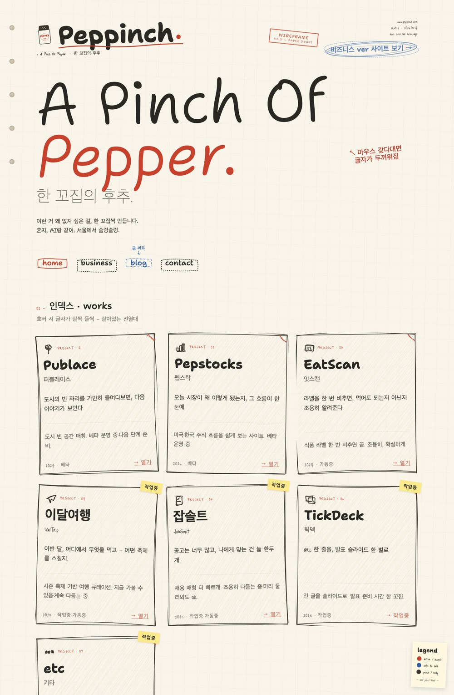

홈페이지를 새로 바꿨어

저 위에 종이 스케치 버전 있잖아
저거 처음 만들 땐 "이렇게 만들어줘" 하고, 음 이건 좀 아닌데 또 고치고, 여기 색 좀 바꿔줘 또 고치고... 그렇게 며칠을 붙들고 있었거든

근데 이번엔 클로드 디자인한테 "이런 느낌으로 바꿔줘" 딱 한마디 했는데
이게 그냥 나와버림
내가 더 손댈 것도 별로 없이 🙂

## 좋은데 왜 좀 무섭지

기분이 진짜 이상하더라구
분명 좋은데... 며칠 끙끙대던 걸 문장 하나가 대신해버리니까
편하긴 한데 어쩐지 좀 싫기도 하고

AI 빨라지는 게 이젠 내가 따라가는 속도보다 빠른 것 같음
반갑고 무섭고, 두 마음이 같이 와버리네

이러다 난 뭐 하고 있어야 되는 거지 😱 싶다가도 ㅋㅋㅋ
일단 오늘은 바뀐 홈이 맘에 드니까 그걸로 됐다 치고
나머지 걱정은... 그건 다음에
